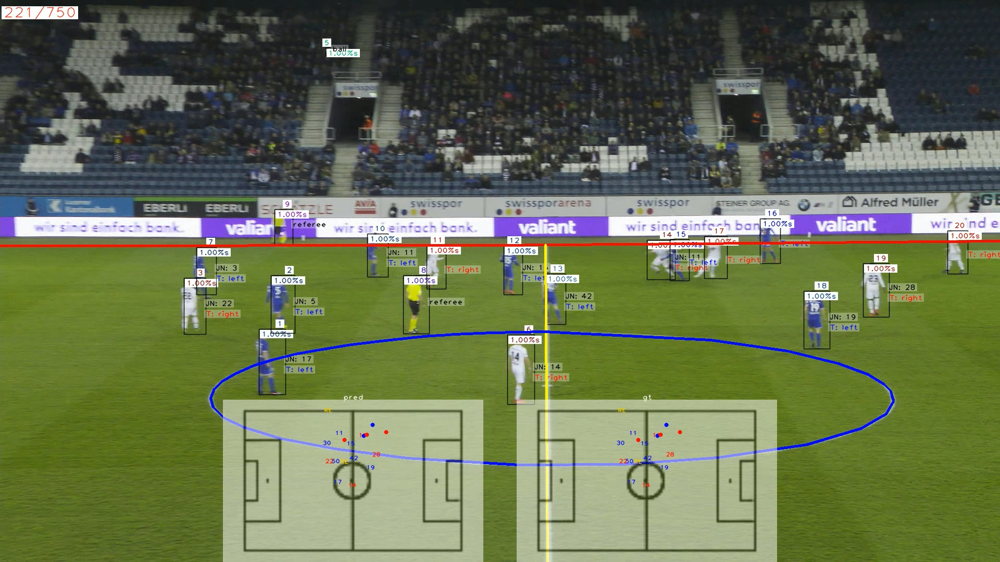

<div align="center">

# SoccerNet Game State Reconstruction — Lightning AI Runner

**End-to-end athlete tracking & identification on a minimap, evaluated on GPU via a single click.**

This repository is the [SoccerNet Game State Reconstruction (GSR)](https://www.soccer-net.org/tasks/new-game-state-reconstruction) baseline (built on [TrackLab](https://github.com/TrackingLaboratory/tracklab)), wired up to run a **full GS-HOTA evaluation on [Lightning AI](https://lightning.ai) GPUs, triggered from GitHub Actions**.



</div>

---

## What this repo gives you

- **One-click evaluation on GPU.** A GitHub Actions workflow dispatches the evaluation to a Lightning AI Studio and runs it on a GPU machine. The Action itself does no heavy compute, so it never hits the runner's CPU/disk/6-hour limits.
- **Nothing to download by hand.** On the first run, TrackLab automatically downloads the **SoccerNetGS dataset**, **all model weights**, and the Python **dependencies** are installed by the run script. Subsequent runs reuse the cached copies on the Studio.
- **Every GSR metric, on both splits.** Each run evaluates the `valid` and `test` splits and reports the full metric suite (see [Metrics](#metrics-reported)).

## Repository layout

```
.
├── .github/
│   ├── workflows/
│   │   └── lightning-eval.yml      # Manual workflow: dispatch evaluation to Lightning AI
│   └── scripts/
│       └── run_lightning_eval.py   # Starts a Studio, syncs the repo, submits the GPU job
├── scripts/
│   └── lightning_eval.sh           # Runs ON Lightning: install deps + evaluate + collect metrics
├── sn_gamestate/                   # GSR-specific modules (jersey, reid, team, calibration, configs)
├── plugins/calibration/            # tracklab_calibration plugin (pitch / camera calibration)
├── pyproject.toml                  # Dependencies (Python 3.9, Torch 1.13.1, mmcv via mim, ...)
├── uv.lock                         # Locked dependency set (uv)
└── README.md
```

## Run it on Lightning AI (main workflow)

### 1. One-time setup — configure Lightning credentials

Add the following in your GitHub repo under **Settings → Secrets and variables → Actions**.

**Secrets** (encrypted):

| Name | Where to find it |
|------|------------------|
| `LIGHTNING_API_KEY` | lightning.ai → avatar → **Global Settings → Keys** |
| `LIGHTNING_USER_ID` | same Keys page |
| `LIGHTNING_USER` | your Lightning username |
| `LIGHTNING_TEAMSPACE` | the teamspace that will own the Studio |

**Variable** (plain text, under the *Variables* tab):

| Name | Value |
|------|-------|
| `LIGHTNING_STUDIO` | a Studio name, e.g. `gsr-eval` (created automatically if it doesn't exist) |

> The workflow stays inert until these are set. Nothing runs — and nothing is billed — until you trigger it.

### 2. Trigger the evaluation

Go to the **Actions** tab → **SoccerNet GSR Evaluation on Lightning AI** → **Run workflow**, and choose:

| Input | Default | Meaning |
|-------|---------|---------|
| `eval_set` | `both` | `valid`, `test`, or `both` |
| `nvid` | `-1` | videos per split (`-1` = all; use a small number for a quick smoke test) |
| `machine` | `A10` | Lightning GPU machine (`T4` / `L4` / `A10` / `A100`) |

The dispatcher submits an **asynchronous** Lightning job and prints a job link in the Actions log. Open that link on Lightning AI to watch progress.

### 3. Get your results

On the Lightning machine, results land in:

- `eval_results/eval_valid.log` and `eval_results/eval_test.log` — full logs containing the printed metric tables.
- `eval_results/outputs/...` — copied TrackEval summary/detailed files.
- `outputs/<experiment>/<date>/<time>/` — the complete run output, including the reconstruction `.mp4` videos.

> **Cost note:** a full evaluation (`nvid=-1`) processes every clip in a split through the whole pipeline and can take several GPU-hours per split. Start with a small `nvid` to validate the wiring, then scale up. Consider an interruptible machine for cost savings.

## Run it locally (optional)

```bash
# 1. Install uv: https://docs.astral.sh/uv/getting-started/installation/
uv venv --python 3.9
uv pip install -e .
uv run mim install mmcv==2.0.1

# 2. Run (dataset + weights auto-download on first use)
uv run tracklab -cn soccernet dataset.eval_set=valid dataset.nvid=1   # quick smoke test
uv run tracklab -cn soccernet dataset.eval_set=test  dataset.nvid=-1  # full test split
```

Configuration lives in [`sn_gamestate/configs/soccernet.yaml`](sn_gamestate/configs/soccernet.yaml); see `uv run tracklab --help` for all options.

## What gets downloaded automatically

| Item | Source | Notes |
|------|--------|-------|
| SoccerNetGS dataset (`train/valid/test/challenge`) | SoccerNet downloader | ~tens of GB; cached after first run. Current dataset version **v1.3**. |
| Model weights (detector, ReID, calibration, OCR) | Auto-fetched by TrackLab | Cached under `pretrained_models/`. |
| Python dependencies | `uv pip install -e .` + `mim install mmcv==2.0.1` | Pinned via `pyproject.toml` / `uv.lock`. |

If a download is interrupted, delete the partial dataset folder and rerun so it starts cleanly.

## Metrics reported

Evaluation runs the SoccerNet [TrackEval fork](https://github.com/SoccerNet/sn-trackeval) on each split, producing:

- **Game-state metric (primary):** `GS-HOTA`, with `GS-DetA` and `GS-AssA`. GS-HOTA extends HOTA with a pitch-space localization similarity (5 m Gaussian tolerance) and a strict identity match across role, team, and jersey number.
- **HOTA family:** `HOTA`, `DetA`, `AssA`, `DetRe`, `DetPr`, `AssRe`, `AssPr`, `LocA`.
- **CLEAR / MOT family:** `MOTA`, `MOTP`, `IDSW`, `FP`, `FN`, `Frag`, `MT`, `PT`, `ML`.
- **Identity family:** `IDF1`, `IDP`, `IDR`.

The metric set is configured in [`sn_gamestate/configs/eval/gs_hota.yaml`](sn_gamestate/configs/eval/gs_hota.yaml).

## Notes & things to confirm

- Requires **Python 3.9** (`>=3.9,<3.10`) for the evaluation environment — handled automatically by the run script via `uv venv --python 3.9`.
- The dispatcher (`.github/scripts/run_lightning_eval.py`) uses the documented `lightning_sdk` API (`Studio`, `Job.run`, `Machine`). Confirm the method/enum names against your installed `lightning_sdk` version when you first set up Lightning.
- Exact TrackEval summary filenames vary by version; the per-split logs always contain the printed metric tables as a fallback.

## Credits

This is a fork/adaptation of the official SoccerNet GSR dev kit. For the task, dataset, baseline, and the GS-HOTA metric, see the paper and original repository:

- Paper: *SoccerNet Game State Reconstruction: End-to-End Athlete Tracking and Identification on a Minimap*, CVPRW'24 — https://arxiv.org/abs/2404.11335
- Original dev kit: https://github.com/SoccerNet/sn-gamestate
- Framework: https://github.com/TrackingLaboratory/tracklab

```bibtex
@inproceedings{Somers2024SoccerNetGameState,
  title     = {{SoccerNet} Game State Reconstruction: End-to-End Athlete Tracking and Identification on a Minimap},
  author    = {Somers, Vladimir and Joos, Victor and Giancola, Silvio and Cioppa, Anthony and Ghasemzadeh, Seyed Abolfazl and Magera, Floriane and Standaert, Baptiste and Mansourian, Amir Mohammad and Zhou, Xin and Kasaei, Shohreh and Ghanem, Bernard and Alahi, Alexandre and Van Droogenbroeck, Marc and De Vleeschouwer, Christophe},
  booktitle = {2024 IEEE/CVF Conf. Comput. Vis. Pattern Recognit. Work. (CVPRW)},
  month     = {Jun},
  year      = {2024},
}
```
